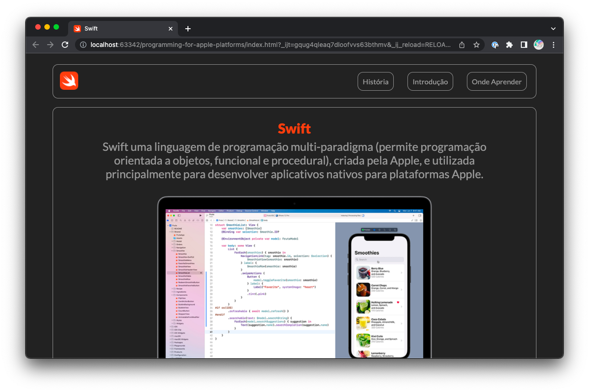

# Programming for Apple Platforms

This is a simple website about programming for Apple platforms development that I built for learning purposes. The website is not affiliated with Apple in any way.

## Overview
The website is designed to provide basic information about iOS development. The website contains the following sections:

* Home page
* Introduction to Swift
* Brief History
* Introduction to Programming for Apple Platforms
* Resources

## Contribution
Contributions to this website are welcome and greatly appreciated! If you have suggestions for improving the content or would like to add additional information or resources, please feel free to submit a pull request or create an issue.